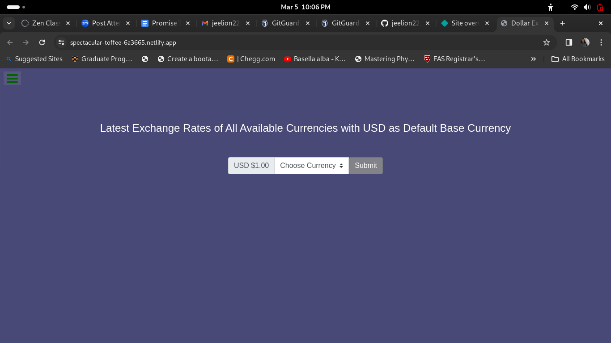
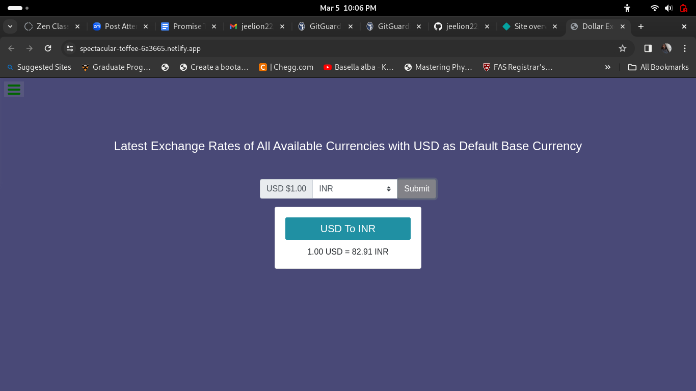

# USD Exchange Value

From this web applicatoin, we can get the current currency value of each country by base value of USD

## Table of Contents

- [Introduction](#introduction)
- [Project Images](#Images)
- [Installation](#installation)
- [Usage](#usage)
- [License](#license)

## Introduction

It is a webpage deployed in Netlify for knowing current currency value of each country based on USD. To achieve this, I used currencyfreeks api. Currency code for each country is available in the drop down list in the web page, and after selecting one of them and then submiting will give the current value.

[Netlify link](https://spectacular-toffee-6a3665.netlify.app/)

## Images

## Installation

No installation is required except a latest web browser.

## Usage

It can be used for getting exchange value of a currency.

## License

MIT License

---
